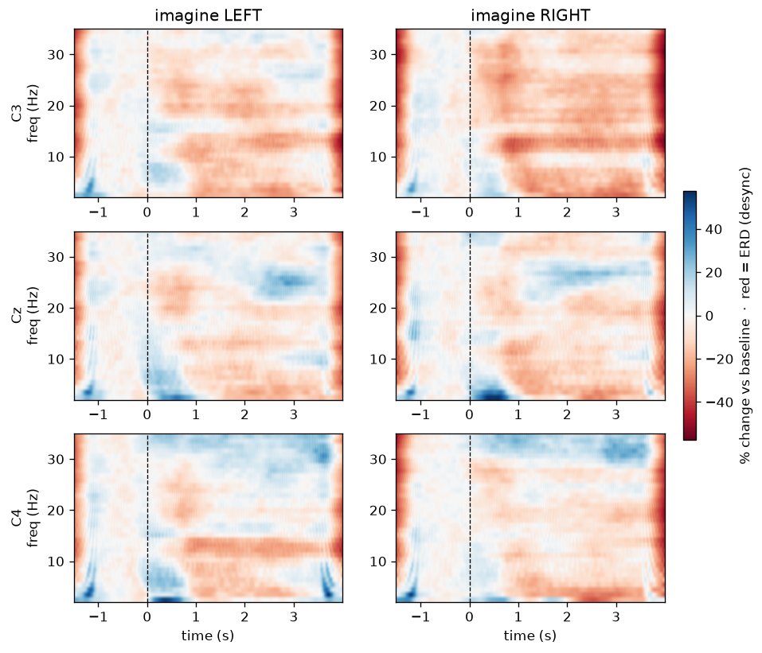
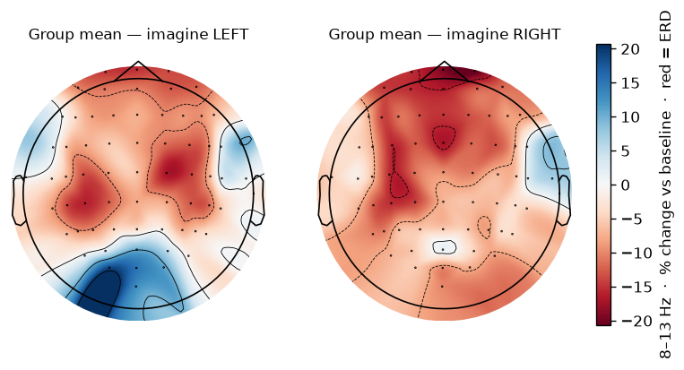

# Empirical ERDS Characterization — Motor Imagery

_Generated mi_erds_20260806T230536Z._ Dataset: **PhysioNet EEGMMIDB** (motor imagery, runs [4, 8, 12]),
subjects **[1, 2, 3, 4, 5, 6, 7, 8, 9, 10]** (n=10).

**Method (canonical).** MNE ERDS-maps recipe (Pfurtscheller & Lopes da Silva 1999): per-epoch
**multitaper** TFR (freqs 2–35 Hz, `n_cycles = freqs`), **percent-change** baseline (−1→0 s),
`decim=3`. Read-outs: ERDS time-frequency maps at C3/Cz/C4 and mu-band (8–13 Hz)
topographies over the 0.5–3.5 s task window. Preprocessing matches EEGPT
(average ref, 0–38 Hz, 256 Hz). Convention: **percent < 0 = ERD** (desync).

**Result — mu lateralization (group, C3 − C4).**
- LEFT imagery (T1): **+0.7%** (expect > 0 → contralateral C4 desync)
- RIGHT imagery (T2): **-8.9%** (expect < 0 → contralateral C3 desync)

Central sensorimotor mu ERD is present during imagery; the ERDS maps show the mu/beta
suppression time course at C3/Cz/C4. Clean bilateral-mirror lateralization sharpens with n and
would sharpen further with spatial filtering / significance testing (see
`docs/findings-and-options.md`). This is the empirical reference for later model comparison.

Artifacts: `qc.csv`, `erd_mu.csv`, `erds.npz`, figures; `config.json` records exact parameters
and package versions.

## Per-subject QC

| subject | sfreq | n_channels | T1 | T2 | high_amp_pct | ok |
| --- | --- | --- | --- | --- | --- | --- |
| 1 | 256.0 | 64 | 23 | 22 | 0.33 | True |
| 2 | 256.0 | 64 | 23 | 22 | 0.07 | True |
| 3 | 256.0 | 64 | 23 | 22 | 2.53 | True |
| 4 | 256.0 | 64 | 23 | 22 | 0.99 | True |
| 5 | 256.0 | 64 | 21 | 24 | 0.05 | True |
| 6 | 256.0 | 64 | 24 | 21 | 0.04 | True |
| 7 | 256.0 | 64 | 23 | 22 | 0.28 | True |
| 8 | 256.0 | 64 | 22 | 23 | 0.29 | True |
| 9 | 256.0 | 64 | 24 | 21 | 5.52 | True |
| 10 | 256.0 | 64 | 24 | 21 | 11.7 | True |

## Figures

**Sensor montage (64-ch, 10-10)**

**Power spectral density (0–45 Hz)**

**ERDS maps at C3/Cz/C4 (group; red = ERD)**

**Mu-band ERD topography — group mean (red = ERD)**

