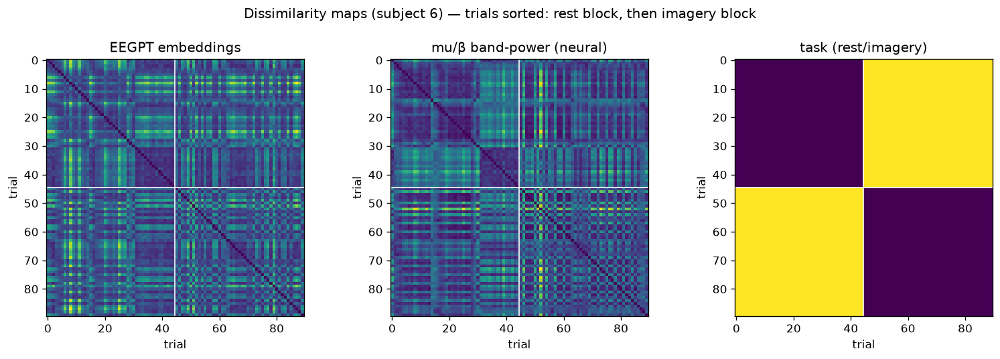
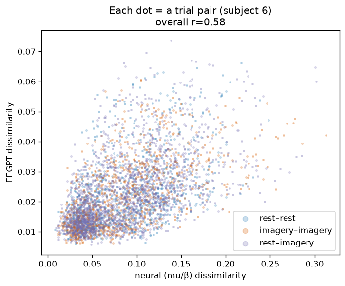
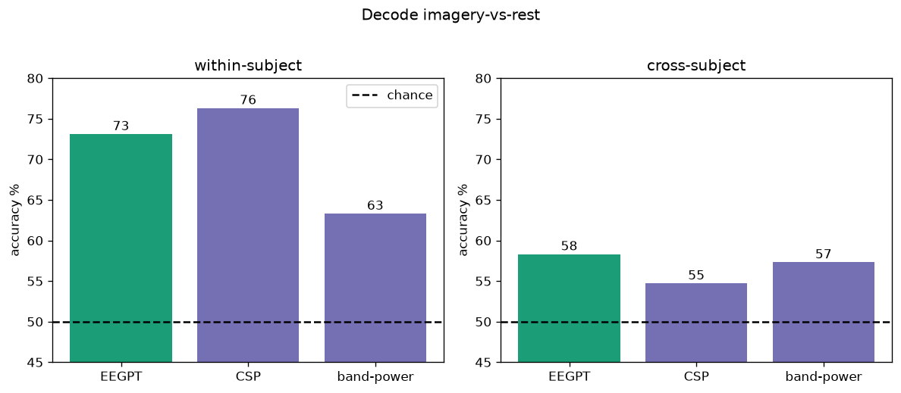

# Pivot: Imagery-vs-Rest Decode and RSA

Current analysis (imagery vs rest), captured so collaborators can track the findings without
re-running. Full write-up: docs/pivot-analysis.md.

**Why the encoder representation.** EEGPT's reusable value is its encoder embedding, the vector
downstream tasks freeze and build on, and the only part braindecode ships. Trust in the model comes
from whether that representation encodes meaningful signal, so interpreting it is the point. The
reconstruction decoder is training machinery discarded at deployment.

**Findings (n=20).** Decoding: EEGPT decodes imagery vs rest about as well as CSP within subject
and best of three across subjects. RSA: after Autoreject cleaning and a non-motor control band,
EEGPT's embedding geometry correlates with band-power broadly but not specifically with mu (mu is
about equal to the control band; beta is modestly higher).

**Interpretation.** EEGPT decodes motor imagery competitively and transfers across subjects, but
its representation is spectrally non-specific, organized by aggregate signal structure more than the
mu/beta rhythms clinicians rely on. This is a trust-relevant interpretability finding. A likely
explanation not yet confirmed is that the correspondence reflects overall signal power.

## Decode (chance 50%)

| method | within % | cross % |
| --- | --- | --- |
| EEGPT embeddings | 73.1 | 58.3 |
| CSP+LDA | 76.3 | 54.7 |
| band-power+LDA | 63.3 | 57.3 |

## Band-resolved RSA

| band | model~neural | partial (task removed) |
| --- | --- | --- |
| mu (8-13) | 0.204 | 0.183 |
| beta (13-30) | 0.243 | 0.228 |
| control (2-7, non-motor) | 0.202 | 0.169 |

## Figures

**Dissimilarity maps: EEGPT vs mu/beta vs task (illustrative subject)**

**Each dot is a trial pair, colored by pair type (rest-rest, imagery-imagery, mixed)**

**Decode accuracy: EEGPT vs classical, within and cross subject**

